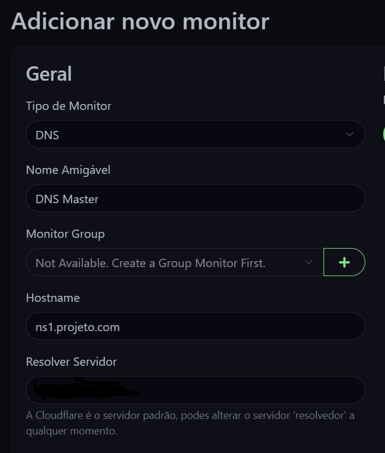

# UpTime Kuma Configuration

## Admin User Acount Creation

1. After the navigation to the dashboard with <mark style="color:red;">`http://your_ip_address`</mark> it will prompt to create a admin acount.

<figure><figcaption>
Fig 1. Admin acount creation
</figcaption></figure>

## Add a New Monitor

1. After the admin acount creation, you can add your <mark style="color:red;">**services to monitor**</mark>, for example a <mark style="color:red;">**DNS Server**</mark>.

<figure><figcaption>
Fig 2. Step 1 of adding a monitor
</figcaption></figure>

 

<figure><figcaption>
Fig 3. Step 2 of adding a monitor
</figcaption></figure>

 

<figure><figcaption>
Fig 4. Step 3 of adding a monitor
</figcaption></figure>

## Check the Dashboard

<figure><figcaption>
Fig 5. Dashboard
</figcaption></figure>
